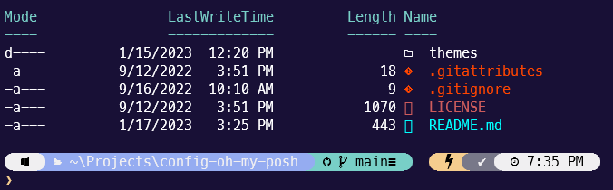

# README-prompt-windows

Instructions on how to make your Microsoft Windows prompts to look like the following.



## Chocolatey

Install via PowerShell

```pwsh
Set-ExecutionPolicy Bypass -Scope Process -Force; [System.Net.ServicePointManager]::SecurityProtocol = [System.Net.ServicePointManager]::SecurityProtocol -bor 3072; iex ((New-Object System.Net.WebClient).DownloadString('https://community.chocolatey.org/install.ps1'))
```

## PowerShell Core

Install via PowerShell

```pwsh
winget install --id Microsoft.Powershell --source winget
```

Note: Perform remaining steps using PowerShell Core unless otherwise stated.

## Curl

Install

```pwsh
choco upgrade curl -y
```

## Git

Install

```pwsh
choco upgrade git -y
```

## Fonts

Install

```pwsh
curl -Lo "$Env:Windir\Fonts\Meslo LG S Regular Nerd Font Complete Windows Compatible.ttf" https://github.com/ryanoasis/nerd-fonts/raw/master/patched-fonts/Meslo/S/Regular/complete/Meslo%20LG%20S%20Regular%20Nerd%20Font%20Complete%20Windows%20Compatible.ttf

reg add "HKLM\SOFTWARE\Microsoft\Windows NT\CurrentVersion\Fonts" /v "MesloLGS NF" /t REG_SZ /d "Meslo LG S Regular Nerd Font Complete Windows Compatible.ttf" /f
```

## Oh-My-Posh

Install

```pwsh
choco upgrade oh-my-posh -y
Remove-Item -Recurse -Force "$Env:USERPROFILE\.config\oh-my-posh"

git clone https://github.com/cscribn/config-oh-my-posh.git  "$Env:USERPROFILE\.config\oh-my-posh"
```

## PowerShell Core Continued

```pwsh
Install-Module -Name Terminal-Icons -Repository PSGallery
Install-Module posh-git -Force
Install-Module PSReadLine -AllowPrerelease -Force

curl -Lo "$Env:USERPROFILE\Documents\PowerShell\Microsoft.PowerShell_profile.ps1" https://raw.githubusercontent.com/cscribn/config-misc/main/powershell-core/Microsoft.PowerShell_profile.ps1
```

## Zsh

Install

```pwsh
Remove-Item -Recurse -Force "$Env:USERPROFILE\.config\zsh"

git clone https://github.com/cscribn/config-zsh.git  "$Env:USERPROFILE\.config\zsh"

Copy-Item -Recurse -Force -Path "$Env:USERPROFILE\.config\zsh\zsh.pkg\*" -Destination "C:\Program Files\Git"
Copy-Item -Force -Path "$Env:USERPROFILE\.config\zsh\zshrc-win" -Destination "$Env:USERPROFILE\.zshrc"
Remove-Item -Recurse -Force "$Env:USERPROFILE\.zsh\zsh-autocomplete"
Remove-Item -Recurse -Force "$Env:USERPROFILE\.zsh\zsh-autosuggestions"
Remove-Item -Recurse -Force "$Env:USERPROFILE\.zsh\zsh-syntax-highlighting"
```

## Kitty

Install

```pwsh
choco upgrade kitty -y
```

Configure

1. Window -> Appearance -> Font to "MeslowLGS NF"
1. Font Quality = Anti-Aliased

## ConEmu (Windows < 10)

Install

```pwsh
choco upgrade conemu -y

curl -Lo "$Env:APPDATA\ConEmu.xml" https://raw.githubusercontent.com/cscribn/config-misc/main/conemu/ConEmu.xml
```

## Microsoft Windows Terminal (Windows >= 10)

Install

```pwsh
choco upgrade microsoft-windows-terminal -y
$LocalStateDir = Get-ChildItem -Path "$Env:LOCALAPPDATA\Packages\Microsoft.WindowsTerminal_*\LocalState"

curl -Lo "$LocalStateDir\settings.json" https://raw.githubusercontent.com/cscribn/config-misc/main/microsoft-windows-terminal/LocalState/settings.json
```

## Vim

Install

```pwsh
choco upgrade vim -y
Set-Location "$Env:USERPROFILE"

curl -Lo ".vimrc" https://raw.githubusercontent.com/cscribn/config-misc/main/vim/vimrc

Copy-Item ".vimrc" -Destination "_vimrc"
Set-Location -
```

## Visual Studio Code

Install

```pwsh
choco upgrade vscode -y
```

Edit settings.json

```json
"terminal.integrated.profiles.windows": {
    "git bash zsh": {
        "path": [
            "C:\\Program Files\\Git\\bin\\bash.exe"
        ],
        "args": [ "-c", "export TERM=cygwin;exec zsh" ],
        "icon": "terminal",
        "overrideName": true
    }
    "terminal.integrated.fontFamily": "MeslowLGS NF",
    "terminal.integrated.fontSize": 13,
```
